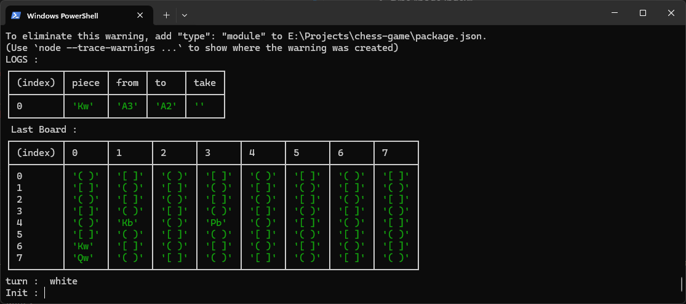
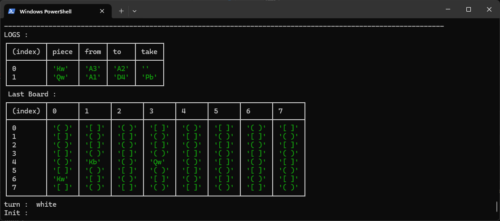

# Chess Game 

this is mini chess mid game console made by : 

Name : Aries Dimas Yudhistira\
Title : Software Engineer

## How to Run a Program

Before you run the program
Just make sure you already install node js LTS version 

If your PC is unix system ( linux or macOS) : 

- open termimal ( wit until terminal is open)
- make sure the print working directory is right
```
~\chess-game> _
```
- type "node index"
- hit enter

if your PC is windows ,
- open folder chess-game
- right click 
- click "Open in Terminal" ( wait until terminal is open )
- and then , type "node index" in terminal 
- hit enter

the screenshot of the program : 


## How To Play

for selecting the chessman , you should input the coordinate like this chessboard as reference : 


the Piece name of the chessman , for example Qw : 

the character on the left is the chessman and the character of the left is the color of the chessman ( b/w )
- Q means Queen
- w means white 

so that means : 

- K means King 
- R means Rook
- KN means Knight 
- P means Pawn 
- B means Bishop 

the first turn , white move first, so...\
if we see the program initiation Qw is on position / coordinate "A1 based on chess board image. so input A1 in prompt "Init" if we selected Queen. hit enter. 
after that prompt input "Move to" show , after that input the coordinate want to move. for example "B1". hit enter 

the program after that 

Before : 


After:


as you can see the Queen take black pawn in D4 , and "check"

Let's Play


